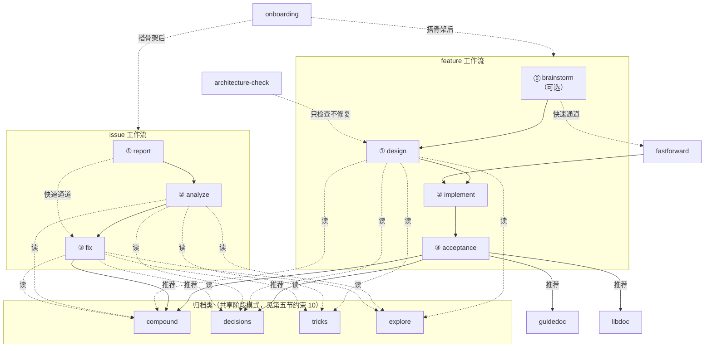

# easysdd

**Easy Spec-Driven Development** —— 本项目的规约驱动开发工作流家族的根技能。

本技能是中心,不替代任何子技能干活。它的职责只有四件事:**介绍**、**路由**、**沉淀共识**、**承载扩展**。具体阶段的操作手册都在子技能里,本技能不重复。

---

## 一、easysdd 是什么

一句话:**任何非 trivial 的工作,先产出 spec,再写代码,最后做闭环验收。**

直接给 AI 一段需求描述就让它写代码,典型失败模式有三种:

1. **术语跟既有代码撞车**:AI 引入的新名词和老代码已有概念语义重叠但叫法不同,后续每次改动都要分辨"这里的 X 是哪种 X"
2. **范围不受控**:AI 顺手改了不该动的地方,或把简单需求实现成过度设计的小框架
3. **不留存档**:功能做完没留下可追溯的设计决定,下次有人在这上面修 BUG 等于从零理解一遍

easysdd 在"需求"和"代码"之间加缓冲层(spec → 不变量 → 分步实现 → 闭环验收),让新代码落地时已经有完整的约束和存档。**核心原则**(适用于所有 easysdd 子工作流):

1. **不从需求直奔代码**。任何非 trivial 的工作都先产出 spec doc,用户 review 通过后再动手
2. **术语先锁死**。spec 里第一节就是术语表;新引入的概念必须显式命名,不能和既有概念撞车
3. **不变量比测试用例更重要**。"测试设计"的核心是列"代码上线后必须永远满足的断言",测试用例只是验证手段
4. **实现分阶段,阶段间有人工 checkpoint**。不允许一口气铺完几百行——早一步截停总比晚一步好
5. **spec doc 是交付物的一部分**。代码交付时同步留下 doc,下一次维护才有据可查

> 这五条原则是所有 easysdd 子工作流共享的——如果某个子技能没有显式提到,默认仍然适用。

---

## 二、目录安排(整个 easysdd 家族共享)

**本节是整个 easysdd 家族目录约定的唯一定义处**。本技能下文以及所有子技能、工作流文档在正文里都**用自然语言术语**(方案 doc、feature 目录……)引用产物,它们的字面位置看下面这棵目录树就能找到。目录结构要改,只在本节改一次。

### easysdd 根目录下有什么

`easysdd/` 下有九个子目录,每个的用途都固定（注意：面向外部读者的文档产物不在 `easysdd/` 下，见组织规则 11–12）:

- **`architecture/`** —— 项目级架构权威目录(AGENTS.md 钦定的"架构中心"),长期存在、跨 feature 共享。里面有 `DESIGN.md`(架构总入口),以及各子系统架构 doc。
- **`features/`** —— 所有 feature spec 的聚合根。每个 feature 一个子目录 `{feature}/`,里面住着该 feature 的 `brainstorm.md`(Stage 0 brainstorm note,可选)、`design.md`(方案 doc,含 YAML frontmatter + 测试设计)、`acceptance.md`(验收报告)。同一 feature 的所有 spec 产物(包括可选的 brainstorm note)永远聚合在一起。
- **`issues/`** —— 所有 issue spec 的聚合根。每个 issue 一个子目录 `{issue}/`,里面住着 `report.md`(问题报告)、`analysis.md`(根因分析)、`fix-note.md`(修复记录,Stage 3 必出产物)。
- **`learnings/`** —— 知识沉淀目录。存放 easysdd-compound 产出的坑点/知识文档,累积式只增不删,按 `YYYY-MM-DD-{slug}.md` 命名。
- **`decisions/`** —— 决策归档目录。存放 easysdd-decisions 产出的技术选型、架构决定、长期约束和编码规约文档,按 `YYYY-MM-DD-{slug}.md` 命名。status=superseded 的文档保留原文不删除。
- **`tricks/`** —— 技巧库目录。存放 easysdd-tricks 产出的编程模式、库用法、技术技巧文档,累积式只增不删,按 `YYYY-MM-DD-{slug}.md` 命名。与 `learnings/` 的区别:learnings 是事件驱动的回顾("做完 X 发现了 Y"),tricks 是面向问题的处方("要做 X 就这样做"),可在任意时间主动写入。
- **`explores/`** —— 探索归档目录。存放 easysdd-explore 产出的仓库探索记录(问题、证据、结论、未决事项),累积式只增不删,按 `YYYY-MM-DD-{slug}.md` 命名。与 `tricks/` 的区别:explores 记录的是"这次为了回答某个问题,在代码里看到了什么"(证据导向),tricks 记录的是"这类问题推荐怎么做"(处方导向)。
- **`tools/`** —— 跨工作流共享的脚本工具目录。目前有 `search-yaml.py`(通用 YAML frontmatter 搜索工具)和 `validate-yaml.py`(YAML 语法校验工具)。新增工具时在此登记。
- **`reference/`** —— 跨工作流共享的参考文档目录。存放不适合继续堆在根技能里的共享规范、模板和手册；完整索引看 `reference/README.md`。

### 目录树示意

```
easysdd/
├── architecture/               ← 架构中心目录
│   ├── DESIGN.md               ← 架构总入口
│   └── {子系统架构 doc}.md
├── features/                   ← feature 聚合根
│   └── {feature}/              ← feature 目录
│       ├── brainstorm.md       ← brainstorm note（Stage 0，可选）
│       ├── design.md           ← 方案 doc（含 YAML frontmatter + 测试设计）
│       ├── checklist.yaml      ← 行动清单（design 阶段生成，implement/acceptance 更新 status）
│       └── acceptance.md       ← 验收报告
├── issues/                     ← issue 聚合根
│   └── {issue}/                ← issue 目录
│       ├── report.md           ← 问题报告(Stage 1)
│       ├── analysis.md         ← 根因分析(Stage 2)
│       └── fix-note.md         ← 修复记录(Stage 3,必出产物)
├── learnings/                  ← 知识沉淀目录
│   └── YYYY-MM-DD-{slug}.md    ← 坑点或知识文档(easysdd-compound 产物)
├── decisions/                  ← 决策归档目录
│   └── YYYY-MM-DD-{slug}.md    ← 技术选型/架构决定/约束/规约(easysdd-decisions 产物)
├── tricks/                     ← 技巧库目录
│   └── YYYY-MM-DD-{slug}.md    ← 编程模式/库用法/技术技巧文档(easysdd-tricks 产物)
├── explores/                   ← 探索归档目录
│   └── YYYY-MM-DD-{slug}.md    ← 仓库探索记录(easysdd-explore 产物)
├── tools/                      ← 工具目录(跨工作流共享的脚本)
│   ├── search-yaml.py          ← 通用 YAML frontmatter 搜索工具
│   └── validate-yaml.py        ← YAML 语法校验工具
└── reference/                  ← 共享参考文档目录
│   ├── README.md               ← reference 目录索引
│   ├── shared-conventions.md   ← 元数据/checklist/收尾推荐等共享口径
│   └── {其他 *-reference 文档}  ← 各工作流模板、长示例、维护说明
```

> `{feature}` 和 `{issue}` 都是占位符,代表具体 feature / issue 的**目录名**。命名格式统一为 `YYYY-MM-DD-{英文 slug}`(例如 `2026-04-11-user-auth`、`2026-04-11-null-pointer-login`),各部分的规则如下:
>
> - **日期前缀**(`YYYY-MM-DD`)—— 取该 feature 目录**首次创建**当日的日期,一经确定就不变。前缀的作用是让 `features/` 下的子目录天然按时间排序,方便后续翻阅。哪怕后续 design 阶段把 feature 改名了,**日期前缀也不改**,只替换后半段的 slug。
> - **英文 slug**(`{英文 slug}`)—— 小写字母 + 数字 + 连字符,不允许大写/下划线/空格/中文。长度短且能一眼看出是什么功能即可。
> - 两部分之间用一个连字符 `-` 连接,整串就是 feature 目录名,也就是本文档里所有 `{feature}` 占位符要被替换成的东西。
>
> 书写约定:正文一律用自然语言术语,不写 `$VAR` 形式的变量,也不在正文里散落字面路径。读者看到不熟的术语回本节目录树查一次即可。

### 组织规则

1. **一个 feature = 一个 feature 目录**。同一 feature 的 brainstorm / design / acceptance 永远聚合在一起。
2. **一个 issue = 一个 issue 目录**。同一问题的 report / analysis / fix-note 永远聚合在一起。
3. **两类 doc 不要混**。`architecture/` 是项目架构权威（长期），方案 doc 是单功能方案（短期），通过方案 doc 第 4 节连接。
4. **feature 和 issue 的产物不要混**：`features/` 和 `issues/` 并列，不交叉存放。
5. **归档目录各管各的，不混放**。每个归档目录只放对应子工作流的产物：

   | 目录 | 产出工作流 | 性质 | 不混于 |
   |---|---|---|---|
   | `learnings/` | easysdd-compound | 经验性（"发现了什么"） | decisions、tricks |
   | `decisions/` | easysdd-decisions | 规范性（"决定了什么"） | learnings、tricks |
   | `tricks/` | easysdd-tricks | 处方性（"该怎么做"） | learnings、decisions |
   | `explores/` | easysdd-explore | 证据性（"看到了什么"） | tricks、decisions |

   spec 产物（design/acceptance/report）不放进任何归档目录。

6. **工具脚本统一放 `tools/`**。新增工具时同步在第二节目录树登记。
7. **共享参考文档统一放 `reference/`**。凡是跨多个子技能复用、但又不适合继续堆在根技能正文里的说明（例如字段口径、工具手册、共享模板说明），都放这里，并在需要的技能里引用。
8. **brainstorm 归属 feature 目录**。AI 根据对话自拟临时 slug（格式 `YYYY-MM-DD-{slug}`），创建 feature 目录后放入 `brainstorm.md`。design 阶段改 slug 只改后半段，日期前缀不变。
9. **新子工作流 / 新产物类型**默认在 `easysdd/` 下开新子目录并在本节登记。唯一例外见规则 10、11。
10. **路径变更唯一源**：要改目录结构，先改本节。
11. **面向外部读者的文档产物不放 `easysdd/`**。guidedoc 产物住 `docs/dev/` 和 `docs/user/`；libdoc 产物住 `docs/api/`。`easysdd/` 只放 spec 工件和内部 reference 文档。如果项目已有其他 docs 目录约定，以项目约定为准。
12. **子技能路径引用约定**。子技能正文用自然语言术语（方案 doc、feature 目录、架构总入口……），具体字面路径统一查本节目录树。子技能里不再重复解释"路径见主技能第二节"——这条规则本身就是默认约定。`{feature}` 和 `{issue}` 是占位符，格式见本节"目录树示意"下方。

---

## 三、目前包含的子工作流

> 每个子工作流的完整操作手册、退出条件、与其他工作流的关系详见各自的子技能 SKILL.md。本节只做**定位索引**——一句话说清"干什么"、核心表格、底层入口，不重复子技能内容。

### easysdd-feature（新功能开发）

适用于：从零实现一个还没做过的功能，或在已有功能上加新的能力。

| 阶段 | 子技能 | 产出 |
|---|---|---|
| ⓪ brainstorm（可选） | `easysdd-feature-brainstorm` | brainstorm note |
| ① 方案设计 | `easysdd-feature-design` | 方案 doc（含 YAML frontmatter）+ checklist.yaml |
| ② 分步实现 | `easysdd-feature-implement` | 代码 + 阶段汇报 |
| ③ 验收闭环 | `easysdd-feature-acceptance` | 验收报告 + 架构归并 |

正式阶段不可跳、不可合并、不可并行。方案 doc 统一带 YAML frontmatter（必填：`doc_type`、`feature`、`status`、`summary`、`tags`）。底层入口：`easysdd-feature` 子技能。

### easysdd-issue（问题修复）

适用于：BUG、异常行为、文档错误——"本来应该好的东西坏了"。

| 阶段 | 子技能 | 产出 |
|---|---|---|
| ① 问题报告 | `easysdd-issue-report` | `report.md` |
| ② 根因分析 | `easysdd-issue-analyze` | `analysis.md` |
| ③ 修复验证 | `easysdd-issue-fix` | 代码修复 + `fix-note.md` |

根因一眼确定时可走快速通道（直接修复 + 仅写 `fix-note.md`）。issue 处理"坏了的东西"，feature 处理"新加的东西"，不混。底层入口：`easysdd-issue` 子技能。

### easysdd-compound（知识沉淀）

适用于：将踩过的坑、最佳实践提炼为可检索文档。两条轨道：Pitfall（坑点）和 Knowledge（知识）。底层入口：`easysdd-compound` 子技能。

### easysdd-decisions（决策归档）

适用于：将已拍板的技术选型、架构决定、约束、规约归档。四种类型：`tech-stack` / `architecture` / `constraint` / `convention`。底层入口：`easysdd-decisions` 子技能。

### easysdd-onboarding（仓库接入）

适用于：把新仓库或有零散文档的仓库接入 easysdd 体系。两条路径：绿地（从零建骨架）和迁移（审计归位）。底层入口：`easysdd-onboarding` 子技能。

### easysdd-tricks（技巧库）

适用于：将可复用的编程模式、库用法、技术技巧整理为可检索文档。三种类型：`pattern` / `library` / `technique`。底层入口：`easysdd-tricks` 子技能。

### easysdd-explore（探索归档）

适用于：对代码仓做定向探索并把结果归档。三种类型：`question` / `module-overview` / `spike`。底层入口：`easysdd-explore` 子技能。

### easysdd-architecture-check（架构一致性检查）

适用于：检查 design 内部是否自洽（`design-internal`），或 design 与代码是否一致（`design-vs-code`）。每次只检查一个目标，只报告不修复。底层入口：`easysdd-architecture-check` 子技能。

### easysdd-guidedoc（文档写作）

适用于：编写或更新开发者指南（`dev-guide` → `docs/dev/`）和用户指南（`user-guide` → `docs/user/`）。底层入口：`easysdd-guidedoc` 子技能。

### easysdd-libdoc（库 API 参考文档）

适用于：为库的公开表面逐条目生成结构化参考文档（→ `docs/api/`），带条目清单追踪。底层入口：`easysdd-libdoc` 子技能。

### （扩展位 — 未来子工作流挂在这里）

### 子工作流依赖拓扑

下图展示所有子工作流之间的依赖与推荐关系，维护者新增子工作流时先在这里定位它的上下游。



**图例**：实线箭头 = 阶段依赖（必须按序）；虚线箭头 = 推荐/读取关系（按需）；快速通道 = 跳过中间阶段。

---

## 四、路由：用户该用哪个子技能

启动本技能后，先做一次定位，**而不是直接开讲解**。根据上下文判断（或直接问用户）：

0. **仓库是否已有 easysdd 目录？** 没有 → `easysdd-onboarding`，搭好再继续。
1. **要做什么？** 按下表路由：

| 用户意图 | 触发子技能 |
|---|---|
| 新功能 / 新能力 | `easysdd-feature`（它内部再路由到 brainstorm/design/implement/acceptance） |
| BUG / 异常 / 文档错误 | `easysdd-issue`（它内部再路由到 report/analyze/fix） |
| 仓库探索 / 提问调研 | `easysdd-explore` |
| 架构一致性检查 | `easysdd-architecture-check` |
| 记录技术选型 / 约束 / 规约 | `easysdd-decisions` |
| 沉淀知识 / 记录踩坑 | `easysdd-compound` |
| 记录编程模式 / 库用法 / 技巧 | `easysdd-tricks` |
| 写/更新开发者指南 / 用户指南 | `easysdd-guidedoc` |
| 写/更新库 API 参考 / 组件文档 | `easysdd-libdoc` |
| 推翻既有模块重做架构 | 不在 easysdd-feature 范围，应独立写重构方案 doc |

2. **如果是 feature** → 继续问"手上已有哪些产物？"，由 `easysdd-feature` 子技能接手路由。
3. **如果是归档/沉淀类**，用下面的速判区分四个归档工作流：

   ```
   这条经验是不是在回顾某次具体事件？（"做 X 时发现了 Y"）
   └─ 是 → easysdd-compound
   └─ 不是 → 这是一个可复用的操作处方？（"要做 X 就这样做"）
              └─ 是 → easysdd-tricks
              └─ 不是 → 这是需要全项目遵守的规定/选型？（"以后都这样"）
                         └─ 是 → easysdd-decisions
                         └─ 不是 → 只是调查了一个问题，留个存档 → easysdd-explore
   ```

每个子技能持有自己的完整路由逻辑和退出条件，本技能只负责把用户送到正确入口，不重复子技能内容。

---

## 五、跨阶段的共同约束

下列规则在所有 easysdd 子工作流里都适用，子技能里如果没显式重复，默认仍然成立。

### 1. 文档是一等产物
- spec doc 是交付物的一部分，代码交付时同步更新。"doc 以后再补" = 永远不补
- 方案 doc 必须带 YAML frontmatter（`doc_type`、`feature`、`status`、`summary`、`tags`）
- issue 文档（report / analysis / fix-note）也必须带 YAML frontmatter（`doc_type`、`issue`、`status`、`tags`），便于 `search-yaml.py` 检索

### 2. 术语锁定与防撞车
- 引入新概念前 grep 既有代码 + 架构中心 + 已有方案 doc，确认无同名概念
- 撞了：改新名或复用旧名。从 design 阶段严格执行

### 3. 阶段间硬 checkpoint
- 退出条件未满足，下一阶段不开始。用户没放行，AI 不自作主张继续

### 4. 范围守护
- "不做什么"每个阶段复核。顺手可优化的代码记 issue，不顺手改
- 引入方案外的新概念 → 先更新方案 doc 第 0 节再继续

### 5. 不变量 > 测试用例
- 验证手段按便宜程度优先选：类型系统 > 单测 > 运行时 assert > 人工

### 6. UI 改动必须浏览器验证
- 前端视觉/交互改动，验收阶段必须人工肉眼验证（`AGENTS.md` 硬要求）

### 7. 开工前搜已有归档（按需，非必做）
- `easysdd-feature-design`、`easysdd-issue-analyze`、`easysdd-issue-fix` 开始前，**先判断是否值得搜**：
  - 功能/问题涉及的模块曾经出过 issue 或有已知 trick → 搜
  - 全新模块、首次开发、归档目录为空 → 跳过，不浪费启动时间
- 值得搜时，用 `search-yaml.py` **一次搜多个目录**，优先复用已有记录：
  - **技巧库**（`tricks/`）：可复用的模式或库用法
  - **探索归档**（`explores/`）：调用链、模块边界、历史结论
  - **知识沉淀**（`learnings/`）：历史踩坑记录
  - **决策归档**（`decisions/`）：已有约束与技术选型
  - **已有方案 doc**（`features/`）：按 `doc_type=feature-design` 检索
- 搜到相关记录：在文档里注明引用。没搜到：正常推进，结束后按需补归档

### 8. 不和 BUG 修复混路径
- feature 工作流不处理 BUG，issue 工作流不做新功能。混路径会让 checkpoint 失效

### 9. 收尾提交（scoped-commit）
- 适用于 `easysdd-feature-acceptance` 和 `easysdd-issue-fix` 的收尾环节
- **必须先问用户**："是否需要我把这次的代码和文档整理成一次 commit？"
- 用户同意后：
  1. `git status` 确认工作区改动
  2. **只提交本次工作流相关文件**（功能/修复代码 + spec 文档 + 更新过的架构 doc）
  3. 工作区混有无关改动且无法安全拆分时，停下来说明，不强行打包
  4. 简短 commit 摘要（如 `feat: add xxx` / `fix: handle xxx`），确认后执行 `git add` + `git commit`
  5. 告知用户 **commit hash + commit message**
- 没有用户明确许可，不做 `git commit`
- 优先把代码和对应 spec 文档放进同一次 commit，保证可追溯

### 10. 归档类工作流共享规则

以下规则适用于 `easysdd-compound`、`easysdd-decisions`、`easysdd-tricks`、`easysdd-explore` 四个归档类子工作流。各子技能里不再重复这些共享规则。

- **只增不删**。归档目录是累积性知识库。过时文档改 `status`（`superseded` / `deprecated` / `outdated`），不物理删除原文
- **宁缺毋滥**。用户说"没什么"的节就省略，空话比没有更糟。可选节不强制填充
- **不替用户写**。要点由用户说出，AI 整理成格式。不允许 AI 凭空捏造细节去填满模板
- **可发现性是交付的一部分**。写完文档但没人能搜到等于没写。每个归档技能的收尾阶段都必须做关联推荐检查
- **标准归档阶段**（各技能可裁剪但不可改序）：
  1. 识别来源/类型（和用户对话确认）
  2. 提炼要点（一次一个问题，不给用户填表格）
  3. 确认内容（AI 起草完整文档含 YAML frontmatter，用户一次性 review）
  4. 归档落盘（写文件 + 用 `search-yaml.py` 搜同目录查重叠 + 报告路径）
  5. 关联推荐（提示是否需要更新 AGENTS.md / DESIGN.md，不自作主张改文件）
- **归档后查重叠**。落盘后搜索同目录下语义相近的已有文档（按 tags / query），如有重叠在新文档末尾"相关文档"节列出，并提示用户是否需要合并或 supersede

### 11. 共享 reference 文档

以下共享说明已拆到 `easysdd/reference/`，根技能只保留入口，不在正文重复展开：

- `shared-conventions.md` —— 共享元数据口径、`checklist.yaml` 生命周期、阶段收尾推荐
- `tools.md` —— `search-yaml.py` / `validate-yaml.py` 的完整用法参考

子技能需要引用这些规则时，直接指向对应 reference 文档，不再写"见根技能第五节约束 X"这类脆弱表述。

### 12. 维护者参考

`easysdd/reference/maintainer-notes.md` 维护根技能不适合继续展开的维护者说明，例如断点恢复策略、扩展点登记规则。

> 约束 10–12 仍由本节维护；共享口径、工具手册和维护者说明已拆到 `easysdd/reference/`，子技能如果与这些 reference 文档冲突，以 reference 文档为准。

---

## 六、当用户问"easysdd 是干嘛的"

如果用户的意图就是"了解 easysdd",不是要立刻开工,按下面顺序回答:

1. **一句话定义**:Easy Spec-Driven Development,本项目的规约驱动开发工作流。
2. **解决什么问题**:用第一节"是什么"里那三种典型失败模式,但**只挑用户当前情况最相关的 1-2 条讲**,不要全念一遍
3. **现在有哪些子工作流**:列第二节的子工作流列表,问用户是否有具体场景对应
4. **给一个最小可执行的下一步**:不要让用户陷在"先了解再决定"的死循环里。问"你现在手上有具体要做的功能吗?如果有,我们直接进 easysdd-feature 流程"

---

## 七、当用户提到一个具体的功能

如果用户在触发本技能时已经描述了一个具体功能(比如"我想给应用加个 X"),不要先长篇介绍 easysdd——介绍是次要的,**路由是主要的**。直接:

1. 简短确认这是新功能(不是 BUG / 重构)
2. 问"你之前写过 brainstorm note / 方案 doc 吗?"或者直接 Glob 所有 feature 目录下的 brainstorm note / 方案 doc,看有没有相关文件
3. 按第四节路由表把用户导到对应子技能
4. 把"easysdd 是什么、为什么这样分阶段"作为路由过程中的**自然解释**带出来,而不是单独的开场白

---

## 八、扩展点(给未来的自己)

扩展维护说明已拆到 `easysdd/reference/maintainer-notes.md`。根技能这里只保留原则：新增子工作流、共享约束、共享模板、共享术语或全局状态机制时，先改目录安排和中心索引，再改子技能，避免信息散落。

---

## 九、相关文档

- `AGENTS.md` — 全项目通用的代码规范和"已知坑"清单,所有子技能都默认遵守
- 架构总入口 — 项目架构文档总入口(路径见第二节"目录安排")
